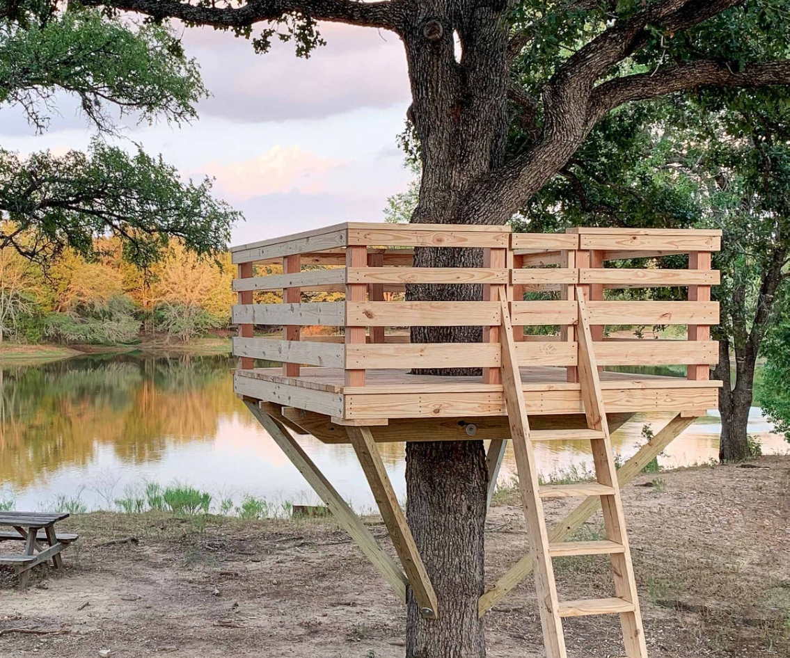

.. raw:: html

    

    Home
    ========

   

|    

    
.. raw:: html

     
    

      

    

    
    Structural Design
    
      

    
Tree Fort

        
       
    
    
Report Example

   
       

    Proj. 0003
            
    
    

    

.. toctree::
    :hidden:
    :maxdepth: 2

    rv100-stdlds.rst
    rv200-programs.rst
    rv300-design.rst

    
