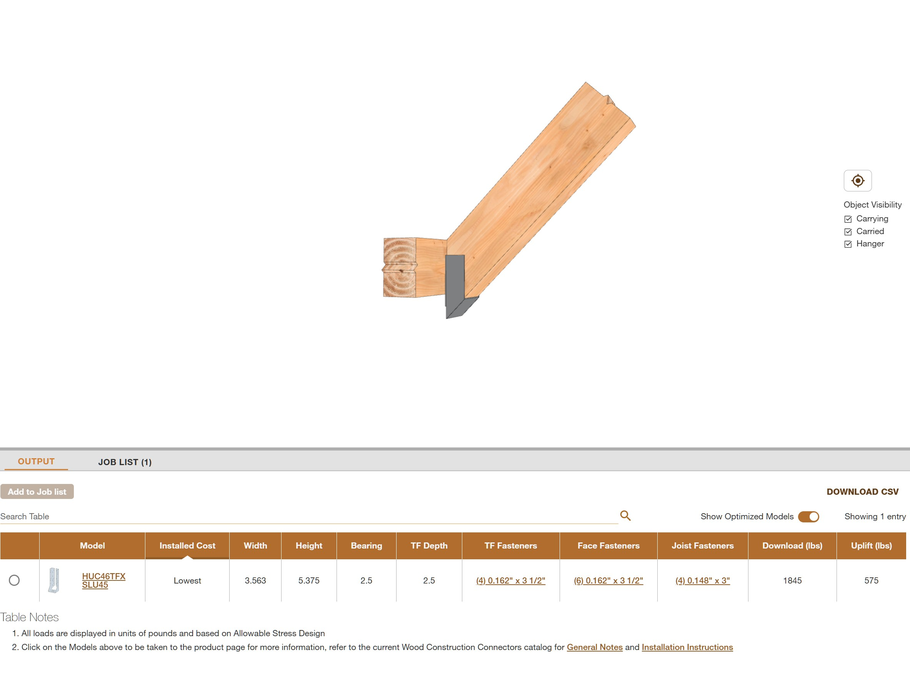
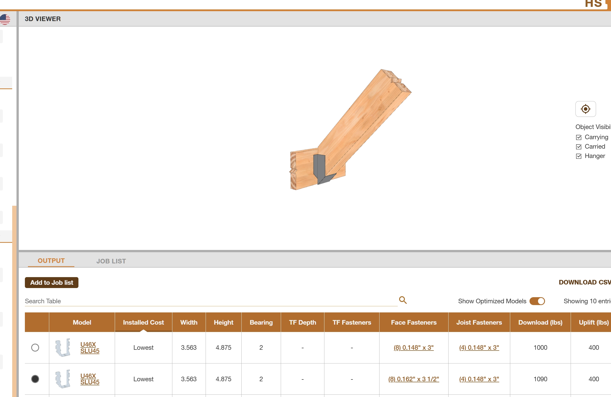
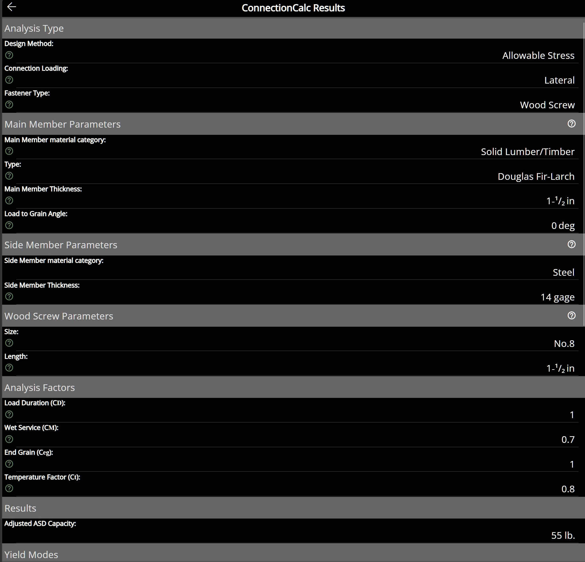
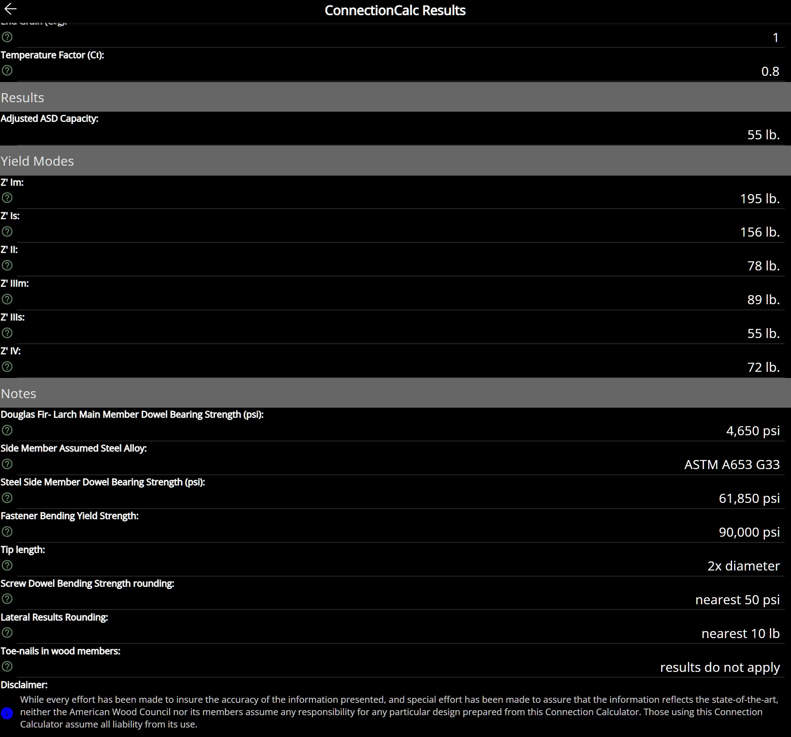

 
.. raw:: pdf

   PageBreak

      

.. _Strut to Tree Connection:

**3.2-1** | Strut to Tree Connection
================================================================================
 
Use Simpson Strong Tie online selection tool.
 

   **Fig. 1.1** - Screen: Option 1   | time: no time 
    

 

   **Fig. 1.2** - Screen: Option 2   | time: no time 
    

 
 

-------------------------

.. _Top rail Corner:

**3.2-2** | Top rail Corner
--------------------------------------------------------------------------------
 
Use AWC online connection tool.
 

   **Fig. 2.1** - Screen: Top Rail - Corner Plate Input   
    

 

   **Fig. 2.2** - Screen: Top Rail - Corner Plate Capacity   
    

 
Use 4-no. 8 screws = 55 lbs * 4 = Capacity 220 lbs | Demand = 200 lbs.
 
 
